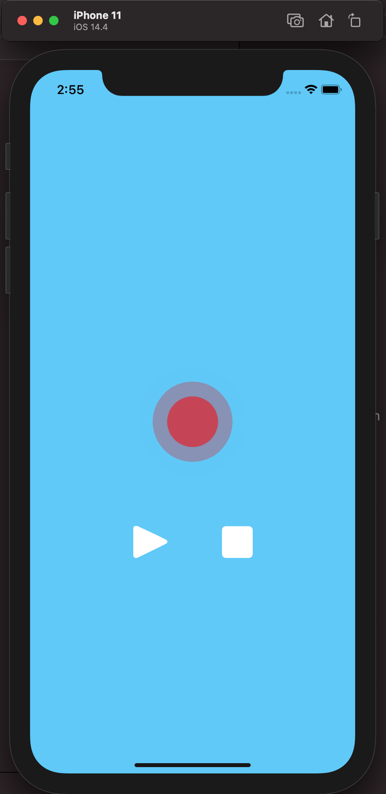
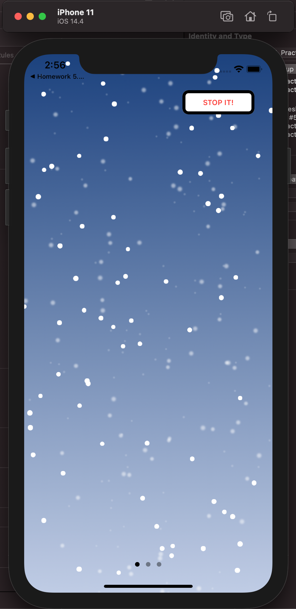
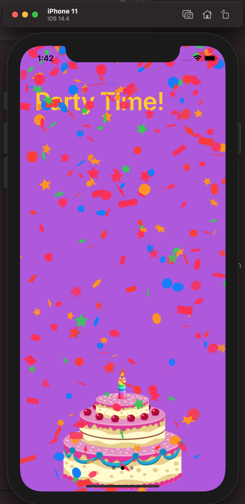
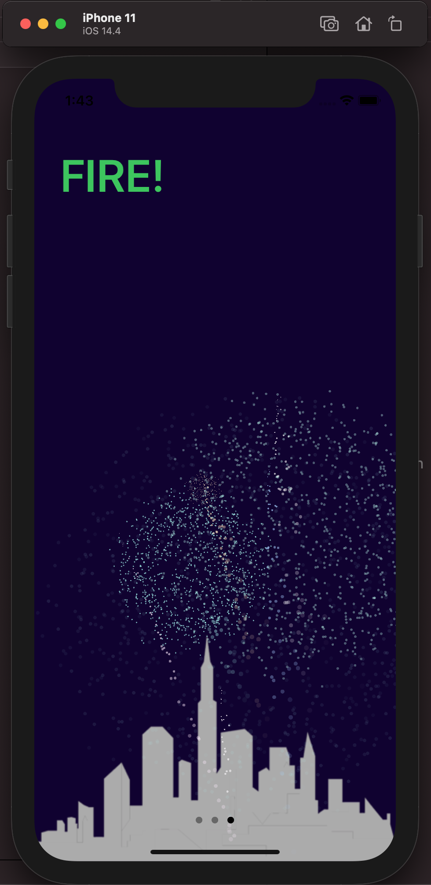

# PM-Homework-5. CoreAnimation

## In this App I create 4 animations

What's in:

- Red circle animation (such as recording)
- Snowfall animation with start/stop button
- Confetti animation (CAEmitterLayer)
- Fireworks animation (CAEmitterLayer)

### Some screenshots:

Practice Animation         |  Snowfall Animation             |  Confetti Animation             |  Fireworks Animation
:-------------------------:|:-------------------------------:|:-------------------------------:|:-------------------------------:
|  |  |  
